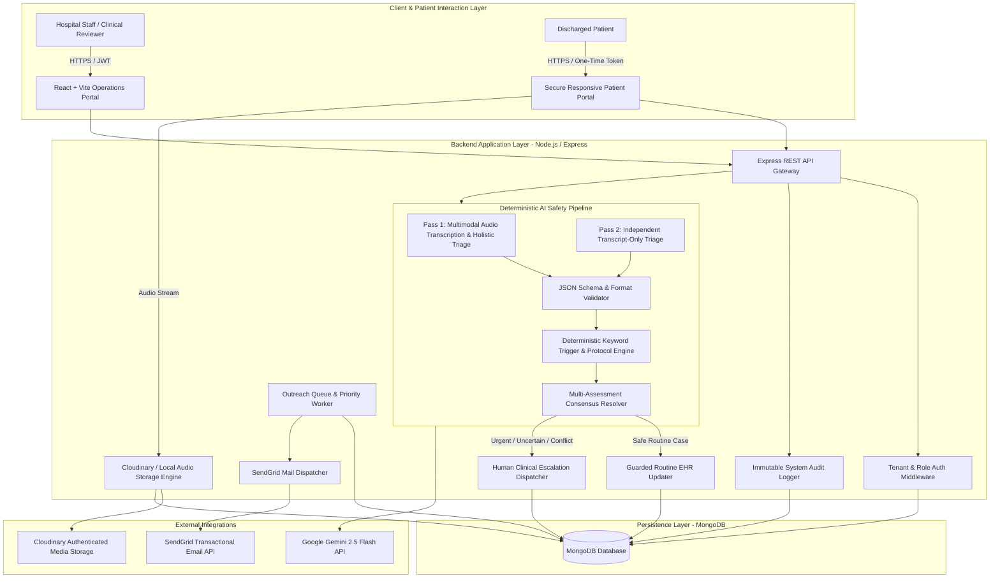
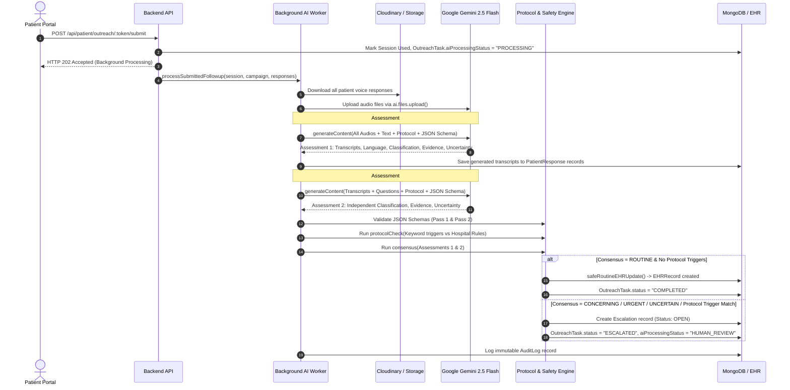
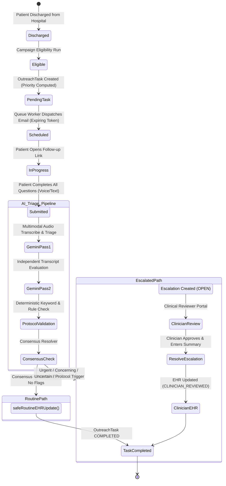
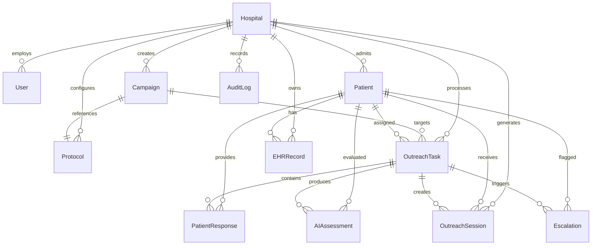

# CareFlow AI — Multi-Hospital Post-Discharge Outreach & Clinical AI Triage Platform

CareFlow AI is an enterprise-grade, multi-tenant clinical outreach and automated post-discharge triage platform. It closes the critical post-hospitalization care gap by automating multi-channel patient follow-ups (Email & Voice/Text Interactive Web Portals), running dual-pass structured AI triage via Google Gemini, enforcing deterministic protocol safety boundaries, routing high-risk/ambiguous cases to human clinicians, and synchronizing validated outcomes to an Electronic Health Record (EHR) system.

---

## Table of Contents

1. [Executive Summary & Problem Statement](#executive-summary--problem-statement)
2. [Core Architecture Deep Dive](#core-architecture-deep-dive)
   - [High-Level System Architecture](#high-level-system-architecture)
   - [Multi-Tenant Data Layer & Isolation](#multi-tenant-data-layer--isolation)
   - [Campaign Management & Dynamic Questionnaires](#campaign-management--dynamic-questionnaires)
   - [Prioritization Engine & Scoring Algorithm](#prioritization-engine--scoring-algorithm)
   - [Outreach Dispatch & Queue Worker Engine](#outreach-dispatch--queue-worker-engine)
   - [Zero-Auth Expiring Token Security Model](#zero-auth-expiring-token-security-model)
   - [Multimodal Voice & Text Patient Portal](#multimodal-voice--text-patient-portal)
   - [Dual-Pass AI Triage & Transcription Engine](#dual-pass-ai-triage--transcription-engine)
   - [Deterministic Safety Boundary & Consensus Engine](#deterministic-safety-boundary--consensus-engine)
   - [Human-in-the-Loop Clinical Review Workflow](#human-in-the-loop-clinical-review-workflow)
   - [Guarded EHR Synchronization & Audit Trail](#guarded-ehr-synchronization--audit-trail)
3. [End-to-End Patient & Clinical Lifecycle](#end-to-end-patient--clinical-lifecycle)
4. [Technology Stack](#technology-stack)
5. [Database Models & Entity Relationships](#database-models--entity-relationships)
6. [API Reference](#api-reference)
7. [Installation & Local Setup](#installation--local-setup)
8. [Environment Variables](#environment-variables)
9. [Pre-Seeded Roles & Demo Accounts](#pre-seeded-roles--demo-accounts)
10. [Synthetic Test Scenarios](#synthetic-test-scenarios)
11. [Verification & Test Utilities](#verification--test-utilities)
12. [Safety Guardrails & Regulatory Disclaimer](#safety-guardrails--regulatory-disclaimer)

---

## Executive Summary & Problem Statement

Preventable hospital readmissions and unmonitored post-discharge complications account for billions in healthcare costs annually. Traditional telephone follow-up workflows suffer from:
- **Low Engagement & Capacity Constraints:** Clinical staff have limited hours to manually dial discharged patients.
- **Data Incompleteness:** Unstructured notes and voicemail tags fail to capture critical clinical signals.
- **Unsafe Automation Risks:** Unregulated LLM agents run the risk of hallucinating diagnoses, altering medication advice, or silently missing emergent symptoms.

**CareFlow AI resolves these challenges through a safety-first architecture:**
- **Zero-Friction Outreach:** Patients receive secure, one-click expiring links via email to submit text or voice responses on any device without login fatigue.
- **Strict Boundary AI:** Google Gemini is utilized exclusively for transcription and structured feature extraction under rigid JSON schemas and temperature `0`.
- **Deterministic Hardcoded Protocols:** AI outputs are validated against hospital-defined clinical trigger keywords (e.g., *fever*, *worsening pain*, *breathing difficulty*, *bleeding*). Hardcoded rules always override AI classifications.
- **Consensus & Human Review:** Ambiguous, conflicting, or urgent cases are immediately locked and routed to clinical staff for resolution before any EHR records are written.

---

## Core Architecture Deep Dive

### High-Level System Architecture

The following diagram illustrates the complete architectural topology of CareFlow AI:



---

### Multi-Tenant Data Layer & Isolation

CareFlow AI is engineered from the ground up for multi-tenant hospital deployments:
- **Tenant Scoping:** Every core document (`Patient`, `Campaign`, `Protocol`, `OutreachTask`, `PatientResponse`, `OutreachSession`, `AIAssessment`, `Escalation`, `EHRRecord`) contains an indexed `hospitalId`.
- **Automatic Query Scoping:** The `tenantScope(req)` middleware extracts the authenticated user's tenant ID from verified JWT claims. Platform Admins retain global visibility, while Hospital Admins, Campaign Managers, and Clinical Reviewers are strictly scoped to their hospital data partition.
- **Isolated Clinical Protocols:** Each hospital configures independent clinical triage guidelines, custom question sets, calling hours, and retry backoff policies.

---

### Campaign Management & Dynamic Questionnaires

Campaign Managers define post-discharge monitoring programs (e.g., *7-Day General Post-Discharge*, *Cardiac Surgery Follow-Up*, *Orthopedic Recovery*):
- **Follow-Up Windows:** Configurable post-discharge eligibility windows (e.g., 7 days post-discharge).
- **Dynamic Modular Questions:** Campaigns define ordered questions with supported response types (`TEXT`, `VOICE`) and requirement flags.
- **Protocol Binding:** Campaigns are explicitly linked to a hospital-approved `Protocol` version containing deterministic safety rules.

---

### Prioritization Engine & Scoring Algorithm

To optimize hospital outreach capacity, the queue computes a dynamic priority score for every outreach task:

$$\text{PriorityScore} = \text{RiskScore} + \text{DeadlineScore} + \text{CampaignPriority} + \text{RetryPenalty} + \text{CallbackBonus}$$

Where:
1. **Patient Risk Score ($\text{RiskScore}$):**
   - $\text{Urgent} = 50$
   - $\text{Unknown} = 40$
   - $\text{Concerning} = 35$
   - $\text{Routine} = 10$
2. **Deadline Pressure Score ($\text{DeadlineScore}$):**
   - Remaining time $< 6\text{ hours} \implies +50$
   - Remaining time $< 12\text{ hours} \implies +35$
   - Remaining time $< 24\text{ hours} \implies +20$
   - Remaining time $\ge 24\text{ hours} \implies +10$
3. **Campaign Weight:** Direct numeric priority assigned to the campaign (e.g., $+20$).
4. **Retry Pressure:** $\min(\text{attempts} \times 5, 10)$.
5. **Callback Scheduled Bonus:** $+40$ if a callback time is requested.

---

### Outreach Dispatch & Queue Worker Engine

The queue processing engine operates either on demand via REST endpoint (`POST /api/queue/process`) or autonomously via a scheduled `node-cron` background worker (`src/workers/queueWorker.js`):
- **Outbound Capacity Throttling:** Respects each hospital's `outboundCapacity` (e.g., max 5 concurrent outreaches) minus currently active calling tasks.
- **Batch Selection:** Fetches tasks in status `PENDING` or `RETRY_SCHEDULED` where `nextAttemptAt <= now`, sorted by `priorityScore DESC, createdAt ASC`.
- **Automated Retry & Backoff:** If delivery fails, attempts are incremented. If attempts exceed `retry.maxAttempts` (default: 3), the task transitions to `MANUAL_FOLLOW_UP`. Otherwise, it is scheduled for retry with exponential/linear backoff (`retry.backoffMinutes`).

---

### Zero-Auth Expiring Token Security Model

To ensure seamless patient accessibility without compromising security:
1. When outreach is dispatched, the system generates a cryptographically secure 64-character hex token via `crypto.randomBytes(32)`.
2. The raw token is sent to the patient's verified email address within a magic link:
   `https://<app-domain>/patient/followup/<rawToken>`
3. The database stores only the SHA-256 hash (`tokenHash = crypto.createHash("sha256").update(token).digest("hex")`) with a 72-hour expiration timestamp.
4. When accessed, the patient portal authenticates exclusively via the token hash.
5. Once submitted, the session is marked `used: true` and locked against future modifications.

---

### Multimodal Voice & Text Patient Portal

The patient follow-up web portal supports responsive text input and in-browser voice recording:
- **Audio Capture:** Utilizes the HTML5 `navigator.mediaDevices.getUserMedia` and `MediaRecorder` API (supporting `audio/webm;codecs=opus`, `audio/webm`, `audio/mp4`).
- **Incremental Auto-Saving:** As the patient completes each question (by text or voice), responses are sent via `multipart/form-data` to `POST /api/patient/outreach/:token/response`.
- **Private Audio Storage:**
  - *Cloudinary Mode:* Audio is uploaded as private/authenticated video/audio assets under folder `careflow/<hospitalId>/<patientId>/<taskId>/`.
  - *Local Fallback Mode:* Audio is stored on local disk under `uploads/` for offline/development environments.
  - *Secure Playback:* Audio is never exposed through public URLs; playback is proxied through token-authenticated backend streams (`GET /api/patient/outreach/:token/response/:questionId/audio`).
- **Completeness Enforcement:** The patient cannot submit the questionnaire until all required campaign questions have an associated response.

---

### Dual-Pass AI Triage & Transcription Engine

CareFlow AI implements a resilient, multi-stage AI triage pipeline powered by `@google/genai` (Google Gemini 2.5 Flash):



#### Dual-Pass AI Mechanics:
1. **Pass 1 (Multimodal Voice & Text Intake):**
   - Downloads all voice responses from secure storage into temporary worker buffers.
   - Uploads audio files to the Gemini Files API (`ai.files.upload`).
   - Dispatches a single combined request to Gemini containing audio URIs, text answers, hospital protocol text, and a rigid JSON schema (`patientAssessmentSchema`).
   - Generates exact verbatim transcripts for each question along with the primary clinical triage assessment.
   - Cleans up temporary audio files and deletes uploaded Gemini file references.
2. **Pass 2 (Independent Transcript-Only Intake):**
   - Transcripts extracted in Pass 1 are formatted as pure text question-answer pairs.
   - Dispatches a second independent evaluation to Gemini (`assessPatientTranscripts`).
   - Gemini evaluates the pure text transcripts against the hospital protocol without bias from prior audio token embeddings.
3. **Resilience & Rate-Limit Handling:**
   - Both AI calls use `generateWithRetry` with exponential backoff handling HTTP 429 and transient 5xx errors.
   - If Gemini is unavailable, the system generates a safe fallback response with `classification: "uncertain"`, `requires_human_review: true`, and `ai_status: "PROVIDER_UNAVAILABLE"`.

---

### Deterministic Safety Boundary & Consensus Engine

Gemini **never** has direct write access to the database or EHR records. All AI results must pass through deterministic code validations in `src/services/validation.js`:

1. **Schema Validation (`validateAIOutput`):**
   - Verifies valid classification enum (`routine`, `concerning`, `urgent`, `uncertain`).
   - Verifies presence of evidence array, uncertainty rating (`low`, `medium`, `high`), and boolean `requires_human_review`.
2. **Deterministic Protocol Scanner (`protocolCheck`):**
   - Scans all patient transcripts against hospital protocol trigger keywords (e.g., *worsening pain*, *fever*, *difficulty breathing*, *severe bleeding*, *fainting*).
   - If an urgent or review-requiring trigger is matched, the system **forces** `requiresHumanReview = true` and overrides the classification, regardless of AI output.
   - If AI classification conflicts with a hospital protocol trigger, human review is forcefully triggered.
3. **Consensus Engine (`consensus`):**
   - Aggregates Pass 1 and Pass 2 assessments.
   - If assessments disagree (tie), the classification is set to `uncertain` and human review is mandated.
   - If any single assessment requires human review, or if the final consensus classification is `urgent` or `uncertain`, clinical review is mandated.

---

### Human-in-the-Loop Clinical Review Workflow

When an outreach task is flagged for human review:
- An `Escalation` record is created with priority matching the highest risk level (`urgent`, `concerning`, `uncertain`).
- The task status transitions to `ESCALATED` with `aiProcessingStatus = "HUMAN_REVIEW"`.
- Hospital clinicians access the **Clinical Review Portal** (`/reviews`), where they can:
  - Inspect full patient encounter details, historical EHR notes, and question responses.
  - Listen to original audio recordings.
  - Review side-by-side Gemini assessments, extracted evidence, uncertainty ratings, and triggered protocol rules.
  - Enter a formal clinical resolution note and submit (`POST /api/reviews/:id/resolve`), which updates the escalation, closes the task, and commits an encounter summary to the EHR.

---

### Guarded EHR Synchronization & Audit Trail

- **Automated Path (`safeRoutineEHRUpdate`):** Only uncontested, verified `ROUTINE` follow-ups with zero safety flags or uncertainty write directly to the `EHRRecord` collection with `source: "post_discharge_outreach"` and `updatedBy: "SYSTEM"`.
- **Clinician Path:** Escalated cases write to `EHRRecord` only after authenticated clinical review with `source: "clinical_review"` and `updatedBy: "<User_ID>"`.
- **Immutable Audit Logging (`AuditLog`):** Every key system transition (`OUTREACH_SENT`, `FOLLOWUP_SUBMITTED`, `AI_ASSESSMENT_COMPLETED`, `ESCALATION_CREATED`, `ESCALATION_RESOLVED`, `EHR_UPDATE`) logs actor identity, timestamp, entity references, and metadata.

---

## End-to-End Patient & Clinical Lifecycle



---

## Technology Stack

| Layer | Technology | Description |
| :--- | :--- | :--- |
| **Backend Runtime** | Node.js (v18+) | ES Module architecture (`"type": "module"`) |
| **Web Framework** | Express.js 4.x | RESTful API routing, centralized error handling |
| **Persistence** | MongoDB & Mongoose 8.x | Multi-tenant schema definitions, indexes, timestamps |
| **AI / LLM Engine** | `@google/genai` | Google Gemini 2.5 Flash / 1.5 Flash (temperature 0, structured JSON schemas, Files API) |
| **Media Storage** | Cloudinary SDK / Local FS | Authenticated audio storage, streaming audio proxy |
| **Email Delivery** | `@sendgrid/mail` | Transactional email delivery with HTML fallback links |
| **Security & Auth** | `jsonwebtoken`, `bcryptjs`, `crypto` | JWT bearer authentication, bcrypt password hashing, SHA-256 token hashing |
| **Scheduling** | `node-cron` | Asynchronous periodic queue processing and retry handling |
| **Frontend Framework**| React 18 & Vite | Single Page Application (SPA), React Router v6 |
| **Audio Processing** | Web Audio API / MediaRecorder | Browser-native audio capture and Opus/WebM/MP4 packaging |
| **UI Styling** | Vanilla CSS Design System | Custom dark/light clinical theme, glassmorphic accents, responsive grid/flexbox layouts |

---

## Database Models & Entity Relationships



### Model Schema Summary

| Model | Key Fields | Description |
| :--- | :--- | :--- |
| **`Hospital`** | `name`, `code`, `timezone`, `callingHours`, `outboundCapacity`, `retry` | Hospital entity with tenant configuration and rate limits. |
| **`User`** | `hospitalId`, `name`, `email`, `passwordHash`, `role`, `active` | System user with RBAC (`PLATFORM_ADMIN`, `HOSPITAL_ADMIN`, `CAMPAIGN_MANAGER`, `CLINICAL_REVIEWER`). |
| **`Patient`** | `hospitalId`, `externalId`, `name`, `email`, `phone`, `dischargeDate`, `risk`, `communicationConsent` | Discharged patient record with communication flags and baseline risk. |
| **`Protocol`** | `hospitalId`, `name`, `version`, `rules` (`trigger`, `classification`, `requiresHumanReview`, `reason`), `sourceText` | Clinical protocol rules and keyword triggers. |
| **`Campaign`** | `hospitalId`, `name`, `status`, `priority`, `followUpDays`, `protocolId`, `questions` | Outreach campaign configuration and questionnaire definitions. |
| **`OutreachTask`**| `hospitalId`, `patientId`, `campaignId`, `status`, `aiProcessingStatus`, `priorityScore`, `attempts`, `deadline` | Core queue work item tracking delivery, retry lifecycle, and AI status. |
| **`PatientResponse`**| `outreachTaskId`, `questionId`, `responseType`, `text`, `audio` (`assetId`, `secureUrl`, `duration`), `transcript` | Individual answer per question, including audio metadata and transcript. |
| **`OutreachSession`** | `hospitalId`, `patientId`, `outreachTaskId`, `tokenHash`, `expiresAt`, `submittedAt`, `used` | One-time expiring security token for patient portal access. |
| **`AIAssessment`** | `outreachTaskId`, `assessmentNo`, `classification`, `evidence`, `uncertainty`, `requiresHumanReview`, `safetyFlags` | Output of each Gemini assessment pass. |
| **`Escalation`** | `hospitalId`, `patientId`, `outreachTaskId`, `status`, `reason`, `priority`, `assignedTo`, `resolution` | Clinical review ticket for cases requiring human intervention. |
| **`EHRRecord`** | `hospitalId`, `patientId`, `encounterId`, `followUpStatus`, `summary`, `source`, `updatedBy` | Mock EHR encounter entry. |
| **`AuditLog`** | `hospitalId`, `actorType`, `actorId`, `action`, `entityType`, `entityId`, `details` | Immutable system and user activity log. |

---

## API Reference

### 1. Authentication (`/api/auth`)
- `POST /api/auth/login`: Authenticate staff credentials; returns JWT and user profile.

### 2. Hospital Operations (`/api/hospitals`)
- `GET /api/hospitals`: List hospitals (tenant-scoped).
- `POST /api/hospitals`: Register new hospital (`PLATFORM_ADMIN`).

### 3. Patient Ingestion (`/api/patients`)
- `GET /api/patients`: List patients for hospital.
- `POST /api/patients`: Create or import discharged patient.

### 4. Outreach Campaigns (`/api/campaigns`)
- `GET /api/campaigns`: List all active campaigns.
- `POST /api/campaigns`: Create campaign with custom question definitions.
- `POST /api/campaigns/:id/eligibility/run`: Evaluate discharged patients against campaign follow-up window and enqueue new outreach tasks.

### 5. Outreach Queue (`/api/queue`)
- `GET /api/queue`: List prioritized outreach tasks with latest AI assessment summaries.
- `GET /api/queue/:id/detail`: Fetch full patient 360° view (task, responses, audio links, EHR history, AI assessments).
- `POST /api/queue/process`: Process queue immediately within hospital outbound capacity.

### 6. Public Patient Portal (`/api/patient`)
- `GET /api/patient/outreach/:token`: Retrieve campaign questions and previous answers using the secure token.
- `GET /api/patient/outreach/:token/response/:questionId/audio`: Authenticated media stream for previously recorded patient voice answers.
- `POST /api/patient/outreach/:token/response`: Save incremental answer (multipart form data with text or audio file).
- `POST /api/patient/outreach/:token/submit`: Complete and lock questionnaire; triggers asynchronous background AI processing pipeline.

### 7. Clinical Review & Escalations (`/api/reviews`)
- `GET /api/reviews`: List open clinical escalations.
- `POST /api/reviews/:id/resolve`: Resolve escalation, assign clinician, and commit encounter summary to EHR.

### 8. Analytics & Monitoring (`/api/dashboard`)
- `GET /api/dashboard/summary`: Operational metrics (total patients, pending tasks, AI processing count, open escalations, EHR commits).

---

## Installation & Local Setup

### Prerequisites
- **Node.js**: v18.0.0 or higher
- **MongoDB**: Local instance (`mongodb://localhost:27017`) or MongoDB Atlas URI
- **Google Gemini API Key**: From [Google AI Studio](https://aistudio.google.com/)
- *(Optional)* **Cloudinary Account**: For cloud audio storage (falls back to local filesystem storage if omitted).
- *(Optional)* **SendGrid API Key**: For real email dispatch (prints to console if omitted).

### 1. Repository Clone & Setup
```bash
git clone https://github.com/ManojKumarTadikonda/Ai.Prof-Assignment.git careflow-ai
cd careflow-ai
```

### 2. Backend Configuration
```bash
cd backend
npm install
cp .env.example .env
```
Edit `backend/.env` with your credentials:
```env
PORT=4000
MONGODB_URI=mongodb://127.0.0.1:27017/careflow
JWT_SECRET=your_super_secret_jwt_key_32_chars_long
APP_URL=http://localhost:5173
API_URL=http://localhost:4000/api
GEMINI_API_KEY=AIzaSy...your_gemini_key_here
GEMINI_MODEL=gemini-2.5-flash

# Optional: Cloudinary Audio Storage
CLOUDINARY_CLOUD_NAME=
CLOUDINARY_API_KEY=
CLOUDINARY_API_SECRET=

# Optional: SendGrid Email Delivery
SENDGRID_API_KEY=
SENDGRID_FROM_EMAIL=
```

### 3. Seed Database & Start Backend
```bash
# Populate database with hospitals, demo users, protocols, campaigns, and synthetic test patients
npm run seed

# Start development server with hot-reloading
npm run dev
```
*Backend runs on: `http://localhost:4000`*

### 4. Frontend Configuration & Launch
```bash
cd ../frontend
npm install
npm run dev
```
*Frontend runs on: `http://localhost:5173`*

---

## Environment Variables

| Variable | Required | Default | Purpose |
| :--- | :---: | :--- | :--- |
| `PORT` | No | `4000` | Backend HTTP server port |
| `MONGODB_URI` | **Yes** | `mongodb://localhost:27017/careflow` | MongoDB connection connection string |
| `JWT_SECRET` | **Yes** | `dev-secret-key-change-in-production` | Secret for signing staff authentication tokens |
| `APP_URL` | **Yes** | `http://localhost:5173` | Base frontend URL for magic outreach links |
| `API_URL` | No | `http://localhost:4000/api` | Base API URL |
| `GEMINI_API_KEY` | **Yes** | — | Google Gemini API key for structured AI triage |
| `GEMINI_MODEL` | No | `gemini-2.5-flash` | Gemini model variant |
| `CLOUDINARY_CLOUD_NAME`| No | — | Cloudinary cloud name for voice storage |
| `CLOUDINARY_API_KEY` | No | — | Cloudinary API key |
| `CLOUDINARY_API_SECRET`| No | — | Cloudinary API secret |
| `SENDGRID_API_KEY` | No | — | SendGrid API key for email delivery |
| `SENDGRID_FROM_EMAIL` | No | `no-reply@careflow.local` | Verified sender email address |

---

## Pre-Seeded Roles & Demo Accounts

All seeded accounts share the default password: **`demo123`**

| Role | Email | Hospital Scope | Access Permissions |
| :--- | :--- | :--- | :--- |
| **Platform Admin** | `platform@careflow.local` | All Hospitals (Global) | Full system administration, all queues, campaigns, reviews, and logs. |
| **Hospital Admin** | `admin@hospital-a.local` | Apollo Demo Hospital | Full access to Hospital A patients, campaigns, queue, and staff. |
| **Campaign Manager** | `manager@hospital-a.local`| Apollo Demo Hospital | Campaign creation, questionnaire setup, eligibility execution, queue processing. |
| **Clinical Reviewer**| `reviewer@hospital-a.local`| Apollo Demo Hospital | Clinical review queue, escalation resolution, EHR updates. |
| **Hospital Admin (B)**| `admin@hospital-b.local` | CityCare Demo Hospital | Hospital B partition (demonstrates multi-tenant isolation). |

---

## Synthetic Test Scenarios

The database seeder (`backend/src/seed.js`) automatically provisions 12 distinct synthetic patient scenarios designed to validate every edge case of the triage pipeline:

1. **`routine`**: Patient reports feeling well, pain improving, no fever. $\implies$ *Result: Routine $\to$ Automated EHR Write.*
2. **`concerning`**: Patient reports moderate worsening pain. $\implies$ *Result: Protocol trigger match $\to$ Escalated for Human Review.*
3. **`urgent`**: Patient reports sudden chest tightness / breathing difficulty. $\implies$ *Result: Urgent safety trigger $\to$ High-Priority Escalation.*
4. **`ambiguous`**: Patient provides vague answers ("I feel a bit strange"). $\implies$ *Result: High AI uncertainty $\to$ Human Review.*
5. **`incomplete`**: Patient skips critical health details. $\implies$ *Result: Uncertain $\to$ Human Review.*
6. **`conflicting`**: Patient reports feeling great, but mentions severe new bleeding. $\implies$ *Result: Conflict detected $\to$ Forced Human Review.*
7. **`no-answer-retry`**: Simulates transient outreach failure $\to$ Exponential retry backoff.
8. **`max-retries-manual-follow-up`**: Outreach exceeds 3 failed attempts $\to$ Transitions to `MANUAL_FOLLOW_UP`.
9. **`callback`**: Patient requested callback $\to$ High priority score boost ($+40$).
10. **`deadline-pressure`**: Follow-up window nearing expiration ($< 6\text{h}$) $\to$ Priority score boost ($+50$).
11. **`voice-routine`**: Validates multi-audio WebM voice recording and multimodal Gemini transcription.
12. **`tenant-isolation`**: Assigned to Hospital B to verify cross-hospital access denial.

---

## Verification & Test Utilities

The backend includes standalone CLI test suites:

### 1. Test Gemini Audio & Transcript Triage
Test end-to-end multimodal audio transcription and AI assessment against MongoDB and Cloudinary without modifying live records:
```bash
cd backend
node src/test-gemini.js
```

### 2. Test SendGrid Email Delivery
Validate transactional email dispatch configuration:
```bash
cd backend
node src/test-email.js
```

---

## Safety Guardrails & Regulatory Disclaimer

> [!IMPORTANT]
> **Safety Architecture Highlights:**
> 1. **Zero Direct EHR Writes from AI:** Google Gemini never writes to MongoDB or the EHR directly.
> 2. **Deterministic Hardcoded Overrides:** Hardcoded hospital rules always take precedence over AI classifications.
> 3. **Consensus Requirement:** Disagreements between AI passes force human clinical review.
> 4. **Fail-Safe Fallbacks:** Rate limits, network partitions, or malformed outputs automatically default to `uncertain` and trigger human clinical review.

> [!CAUTION]
> **Regulatory Notice:** CareFlow AI is an administrative outreach and clinical decision-support prototype. It does not provide definitive medical diagnoses, prescribe medications, or replace certified healthcare practitioners. All clinical data presented in demo environments is synthetic. Real email inboxes should be utilized only with explicit consent during testing.

---

## Prototype PRD Additions

This prototype keeps the original CareFlow architecture and adds the operational controls required for the assignment:

- Atomic outbound capacity reservation and task leasing.
- Queue state transitions, retry/backoff, callbacks, deadline pressure and stale-worker recovery.
- A deterministic 25-patient queue simulation that does not require paid telephony.
- Campaign lifecycle controls: READY, SCHEDULED, RUNNING, PAUSED, COMPLETED, CANCELLED/FAILED.
- Tenant-aware knowledge retrieval with source references.
- Controlled AI/application tools for patient lookup, protocol lookup, callback scheduling, escalation and mock EHR operations.
- FHIR-shaped prototype resources: Encounter, Condition, Observation, Medication, CarePlan and Communication.
- Operational dashboard metrics and queue health endpoint.
- Workflow events with idempotency keys.
- Safety evaluation dataset with TP/FP/TN/FN and false-negative rate calculation.
- Core automated tests for priority, protocol safety and consensus behavior.

### Queue Simulation

Use the **Queue Simulation** page after logging in as a Campaign Manager/Hospital Admin. Reset reuses the seeded demo patients/tasks created by Campaign → Eligibility. The seed contains 30 demo patients total (24 in Hospital A and 6 in Hospital B), and the same two test inboxes are used for all patient outreach. Start runs the deterministic queue simulation; Step advances one queue cycle; Pause stops it. Real prototype outreach remains available through the original `/api/queue/process` path.

### Safety Evaluation

Run:

```bash
npm run safety:evaluate
```

For a no-provider local harness:

```bash
SAFETY_EVAL_USE_GEMINI=false npm run safety:evaluate
```

For the actual Gemini-backed evaluation, configure `GEMINI_API_KEY` and run with `SAFETY_EVAL_USE_GEMINI=true`. The script writes `src/evaluation/results.json`.

### Important prototype boundary

Real outbound telephony is intentionally not required. The PRD explicitly allows deterministic call simulation for the core workflow; real telephony is an enhancement. This prototype therefore focuses engineering effort on queue correctness, safety, multi-tenancy, escalation, documentation, mock EHR, observability and evaluation.
