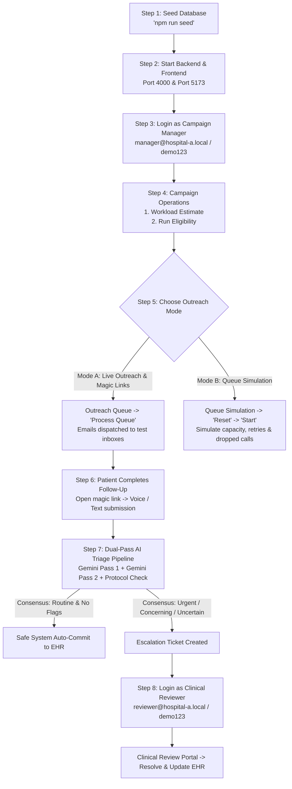
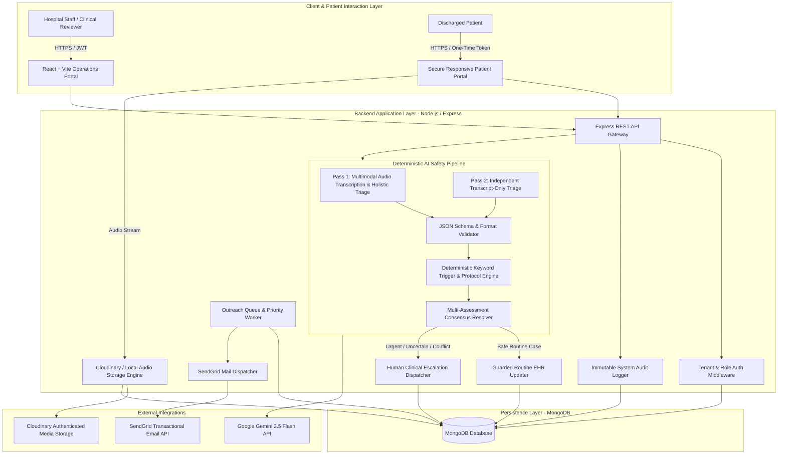
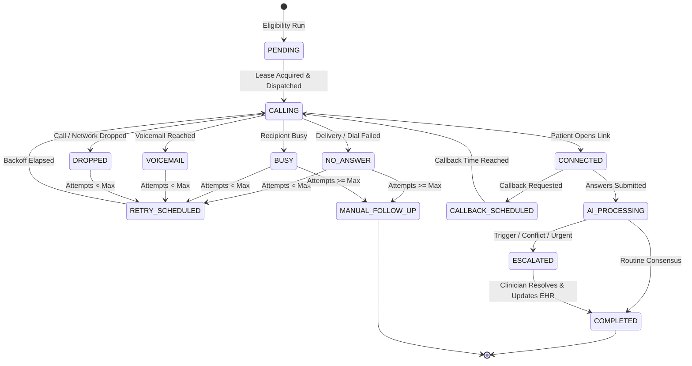
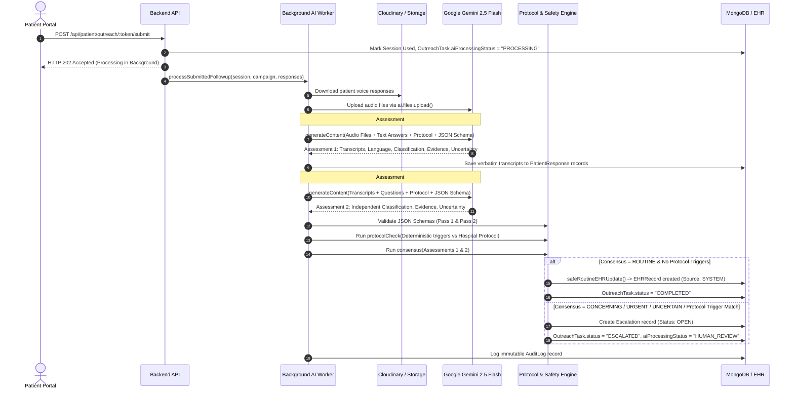
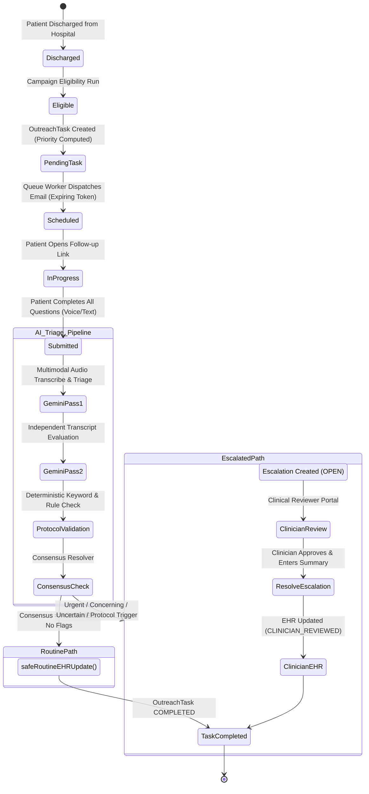
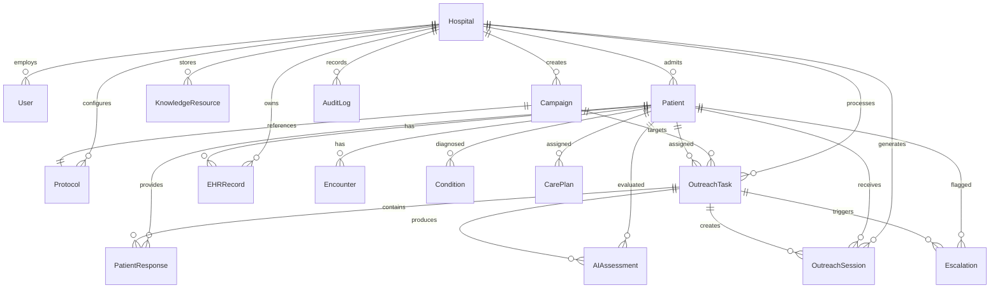

# CareFlow AI — Multi-Hospital Post-Discharge Outreach & Clinical AI Triage Platform

CareFlow AI is an enterprise-grade, multi-tenant clinical outreach and automated post-discharge triage platform. It closes the critical post-hospitalization care gap by automating multi-channel patient follow-ups (Email & Voice/Text Interactive Web Portals), running dual-pass structured AI triage via Google Gemini, enforcing deterministic protocol safety boundaries, routing high-risk/ambiguous cases to human clinicians, and synchronizing validated outcomes to an Electronic Health Record (EHR) system.

---

> [!IMPORTANT]
> ### ⚠️ MANDATORY FIRST STEP: Seed Database Before Running Processes
> **You MUST run `npm run seed` in the backend before executing any workflow or simulation processes.**
> The seeder initializes all tenant hospitals, RBAC user accounts, clinical protocols, knowledge resources, running campaigns, and provisions **30 synthetic demo patients** (with FHIR-aligned encounters, active recovery conditions, and care plans) mapped across two real test email inboxes (add your emails).
> 
> **Standard Execution Order:**
> 1. `cd backend && npm run seed` *(Clears and initializes seed data)*
> 2. `npm run dev` in backend & `npm run dev` in frontend
> 3. Log into the Staff Portal using one of the pre-seeded demo accounts (Password: `demo123`)
> 4. Run Campaign Operations: **Workload Estimate** $\to$ **Eligibility Run** (populates the prioritized queue)
> 5. Process Outreach via **Outreach Queue** (live magic link emails) or test the deterministic **Queue Simulation**
> 6. Complete patient responses $\to$ Observe dual-pass AI triage $\to$ Resolve clinical escalations $\to$ Verify EHR synchronization.

---

## Table of Contents

1. [Pre-Seeded Roles & Demo Credentials](#pre-seeded-roles--demo-credentials)
2. [Step-by-Step Operational Workflow](#step-by-step-operational-workflow)
3. [Core Architecture Deep Dive](#core-architecture-deep-dive)
   - [High-Level System Architecture](#high-level-system-architecture)
   - [Multi-Tenant Data Layer & FHIR-Shaped Models](#multi-tenant-data-layer--fhir-shaped-models)
   - [Campaign Management & Dynamic Questionnaires](#campaign-management--dynamic-questionnaires)
   - [Prioritization Engine & Scoring Algorithm](#prioritization-engine--scoring-algorithm)
   - [Outreach Dispatch & Queue State Machine](#outreach-dispatch--queue-state-machine)
   - [Zero-Auth Expiring Token Security Model](#zero-auth-expiring-token-security-model)
   - [Multimodal Voice & Text Patient Portal](#multimodal-voice--text-patient-portal)
   - [Dual-Pass AI Triage & Transcription Engine](#dual-pass-ai-triage--transcription-engine)
   - [Deterministic Safety Boundary & Consensus Engine](#deterministic-safety-boundary--consensus-engine)
   - [Human-in-the-Loop Clinical Review Workflow](#human-in-the-loop-clinical-review-workflow)
   - [Guarded EHR Synchronization & Audit Trail](#guarded-ehr-synchronization--audit-trail)
   - [Tenant-Aware Knowledge Base](#tenant-aware-knowledge-base)
   - [Deterministic Queue Simulation](#deterministic-queue-simulation)
4. [End-to-End Patient & Clinical Lifecycle](#end-to-end-patient--clinical-lifecycle)
5. [Synthetic Demo Scenarios (30 Cases)](#synthetic-demo-scenarios-30-cases)
6. [Technology Stack](#technology-stack)
7. [Database Models & Entity Relationships](#database-models--entity-relationships)
8. [API Reference](#api-reference)
9. [Installation & Local Setup](#installation--local-setup)
10. [Environment Variables](#environment-variables)
11. [Verification, Testing & Safety Evaluation](#verification-testing--safety-evaluation)
12. [Safety Guardrails & Regulatory Disclaimer](#safety-guardrails--regulatory-disclaimer)

---

## Pre-Seeded Roles & Demo Accounts

All seeded accounts share the default password: **`demo123`**

| Role | Email | Hospital Scope | Access Permissions & Responsibilities |
| :--- | :--- | :--- | :--- |
| **Platform Admin** | `platform@careflow.local` | **Global** (All Hospitals) | Full system-wide administration, tenant onboarding, cross-hospital campaign management, global queue oversight, clinical reviews, knowledge base, and immutable audit logs. |
| **Hospital Admin** | `admin@hospital-a.local` | **Apollo Demo Hospital** (`HOSP-A`) | Full management for Hospital A: configure hospital settings (calling hours, capacity limits, retry backoff, escalation contacts), provision staff users, manage knowledge base resources, view campaigns and queue. |
| **Campaign Manager** | `manager@hospital-a.local` | **Apollo Demo Hospital** (`HOSP-A`) | Campaign operations: lifecycle state control (`READY`, `RUNNING`, `PAUSED`), workload estimation, patient eligibility execution, queue dispatch, and deterministic queue simulation controls. |
| **Clinical Reviewer** | `reviewer@hospital-a.local` | **Apollo Demo Hospital** (`HOSP-A`) | Clinical escalation portal: inspect patient clinical context, listen to raw voice recordings, review side-by-side Gemini AI assessments & triggered protocol safety rules, document resolutions, and commit approved summaries to EHR. |
| **Hospital Admin (B)** | `admin@hospital-b.local` | **CityCare Demo Hospital** (`HOSP-B`) | CityCare tenant partition: demonstrates multi-tenant data isolation, independent protocol configurations, and partitioned patient queues. |

---

## Step-by-Step Operational Workflow

To experience the complete platform lifecycle, follow this operational sequence:



1. **Seed Data First**: Run `npm run seed` in the `backend/` directory. This creates both hospitals, staff credentials, protocols, knowledge resources, active campaigns, and 30 synthetic demo patients.
2. **Launch Applications**: Start the backend (`npm run dev` in `backend/`) and frontend (`npm run dev` in `frontend/`).
3. **Authenticate**: Navigate to `http://localhost:5173/login` and sign in (e.g., `manager@hospital-a.local` / `demo123`).
4. **Campaign Ingestion & Eligibility**:
   - Navigate to the **Campaigns** tab (`/campaigns`).
   - Click **Estimate** to calculate workload.
   - Click **Eligibility** to evaluate discharged patients against the campaign window. This creates 24 prioritized outreach tasks for Hospital A.
5. **Dispatch Outreach or Run Simulation**:
   - **Live Outreach Flow**: Navigate to **Outreach Queue** (`/queue`) and click **Process Queue**. Magic links are dispatched via SendGrid (or logged to backend console). Open the magic link, answer questions via text or voice recording, and click **Submit follow-up**.
   - **Simulation Flow**: Navigate to **Queue Simulation** (`/simulation`), click **Reset**, and click **Start** or **Step** to observe concurrent capacity management, retry backoff, callback handling, and automatic escalations in real-time.
6. **Dual-Pass AI Triage**: When a patient submits a follow-up, Google Gemini 2.5 Flash executes a multimodal pass and an independent transcript pass. Results are evaluated against hardcoded hospital protocol rules.
7. **Clinical Review & Resolution**: Cases flagged as `concerning`, `urgent`, or `uncertain` transition to `ESCALATED`. Sign in as `reviewer@hospital-a.local` (`/reviews`), inspect the side-by-side evidence, listen to the audio stream, and click **Resolve + update EHR**.

---

## Core Architecture Deep Dive

### High-Level System Architecture



---

### Multi-Tenant Data Layer & FHIR-Shaped Models

CareFlow AI is architected with strict multi-tenant isolation and standard healthcare data primitives:
- **Tenant Scoping:** Every clinical document (`Patient`, `Encounter`, `Condition`, `Observation`, `Medication`, `CarePlan`, `Communication`, `Campaign`, `Protocol`, `OutreachTask`, `Escalation`, `EHRRecord`, `KnowledgeResource`) contains an indexed `hospitalId`.
- **Automatic Query Scoping:** The `tenantScope(req)` middleware extracts the authenticated tenant ID from verified JWT claims. Global admins maintain oversight across all hospitals, while hospital-specific users are strictly scoped to their partition.
- **FHIR-Shaped Entities:** Patient records include structured encounters, diagnoses/conditions, care plans, medications, observations, and communication records aligned with modern healthcare interoperability standards.

---

### Campaign Management & Dynamic Questionnaires

Campaign Managers define post-discharge monitoring programs (e.g., *General Post-Discharge Follow-Up*, *Cardiac Recovery*, *Orthopedic Care*):
- **Lifecycle States:** `DRAFT` $\to$ `READY` $\to$ `SCHEDULED` $\to$ `RUNNING` $\to$ `PAUSED` $\to$ `COMPLETED` / `CANCELLED` / `FAILED`.
- **Workload Estimation:** On-demand calculation of eligible patient counts and expected call/outreach attempts based on historical retry ratios.
- **Configurable Questionnaires:** Dynamic questions supporting `TEXT` and `VOICE` response types with mandatory completion validation.
- **Protocol Binding:** Campaigns bind to versioned hospital protocols containing deterministic safety triggers.

---

### Prioritization Engine & Scoring Algorithm

To optimize clinical outreach capacity, the queue dynamically computes a composite priority score for every outreach task:

$$\text{PriorityScore} = \text{RiskScore} + \text{DeadlineScore} + \text{CampaignPriority} + \text{RetryPenalty} + \text{CallbackBonus}$$

Where:
1. **Patient Baseline Risk ($\text{RiskScore}$):**
   - $\text{Urgent} = 50$
   - $\text{Unknown} = 40$
   - $\text{Concerning} = 35$
   - $\text{Routine} = 10$
2. **Deadline Pressure Score ($\text{DeadlineScore}$):**
   - Remaining time $< 6\text{ hours} \implies +50$
   - Remaining time $< 12\text{ hours} \implies +35$
   - Remaining time $< 24\text{ hours} \implies +20$
   - Remaining time $\ge 24\text{ hours} \implies +10$
3. **Campaign Weight:** Numeric priority score assigned to the campaign (e.g., $+20$).
4. **Retry Pressure:** $\min(\text{attempts} \times 5, 10)$.
5. **Callback Bonus:** $+40$ when a patient or clinician schedules a specific callback time.

---

### Outreach Dispatch & Queue State Machine

The queue worker manages task lifecycles with atomic concurrency leasing and automatic recovery:



- **Atomic Outbound Capacity:** Enforces hospital-level concurrency limits (`outboundCapacity`) using atomic Mongo find-and-modify lease reservations.
- **Exponential / Linear Backoff:** Automatically reschedules failed attempts (`backoffMinutes`) up to `maxAttempts` (default: 3).
- **Stale Lease Recovery:** Background workers automatically release expired locks from crashed or disconnected tasks.

---

### Zero-Auth Expiring Token Security Model

To ensure friction-free patient engagement without password fatigue:
1. When outreach is dispatched, the system generates a cryptographically secure 64-character hex token via `crypto.randomBytes(32)`.
2. The raw token is sent to the patient's verified email address within a magic link:
   `http://localhost:5173/patient/followup/<rawToken>`
3. The database stores only the SHA-256 hash (`tokenHash = crypto.createHash("sha256").update(token).digest("hex")`) with a 72-hour expiration timestamp.
4. When accessed, the patient portal authenticates exclusively via the token hash.
5. Upon submission, the session is marked `used: true` and locked against any further modifications.

---

### Multimodal Voice & Text Patient Portal

The responsive patient follow-up portal supports both text responses and in-browser voice recordings:
- **Audio Recording:** Captures high-fidelity audio via the HTML5 `navigator.mediaDevices.getUserMedia` and `MediaRecorder` API (`audio/webm;codecs=opus`, `audio/webm`, `audio/mp4`).
- **Incremental Auto-Saving:** As the patient completes each question (via text or voice), answers are auto-saved via `multipart/form-data` to `POST /api/patient/outreach/:token/response`.
- **Private Audio Storage:**
  - *Cloudinary Mode:* Audio is uploaded as private/authenticated media assets under `careflow/<hospitalId>/<patientId>/<taskId>/`.
  - *Local Fallback Mode:* Audio is stored locally in `uploads/` for offline and air-gapped development environments.
  - *Secure Audio Proxy:* Audio files are never exposed publicly; playback is securely streamed through token-authenticated backend endpoints (`GET /api/patient/outreach/:token/response/:questionId/audio`).
- **Completeness Verification:** The portal requires all mandatory campaign questions to have an answer before unlocking final submission.

---

### Dual-Pass AI Triage & Transcription Engine

CareFlow AI implements a dual-pass AI assessment architecture powered by Google Gemini 2.5 Flash:



#### Dual-Pass AI Mechanics:
1. **Pass 1 (Multimodal Audio & Text Intake):**
   - Downloads recorded voice responses into memory buffers.
   - Uploads audio files to Google Gemini Files API (`ai.files.upload`).
   - Dispatches a single structured prompt with audio URIs, text answers, hospital protocol text, and a rigid JSON schema.
   - Extracts exact verbatim transcripts for each question along with the primary clinical assessment.
   - Deletes uploaded Gemini file references immediately upon completion.
2. **Pass 2 (Independent Transcript-Only Intake):**
   - Transcripts extracted in Pass 1 are evaluated against the hospital protocol in an independent second call.
   - Evaluates text without acoustic bias to cross-validate clinical findings.
3. **Resilience & Rate-Limit Handling:**
   - Both AI calls use exponential retry logic to handle transient 429 rate limits or 5xx errors.
   - If the AI provider is unavailable, the pipeline falls back gracefully to `classification: "uncertain"`, `requires_human_review: true`, and flags the case for human clinician review.

---

### Deterministic Safety Boundary & Consensus Engine

Google Gemini **never** has direct write access to the database or EHR records. All AI outputs pass through deterministic validations in `src/services/validation.js`:

1. **Schema Validation (`validateAIOutput`):**
   - Enforces strict classification enums (`routine`, `concerning`, `urgent`, `uncertain`).
   - Verifies the presence of evidence arrays, uncertainty ratings (`low`, `medium`, `high`), and `requires_human_review` flags.
2. **Deterministic Protocol Scanner (`protocolCheck`):**
   - Scans verbatim transcripts and text answers for hospital trigger keywords (e.g., *worsening pain*, *fever*, *difficulty breathing*, *severe bleeding*, *fainting*).
   - If an urgent or review-requiring trigger is matched, the system **forces** `requiresHumanReview = true` and overrides the AI classification. Hardcoded safety rules always supersede AI predictions.
3. **Consensus Engine (`consensus`):**
   - Aggregates Pass 1 and Pass 2 assessments.
   - If assessments disagree, the consensus classification is set to `uncertain` and human review is mandated.
   - If any single assessment requires human review, or if the final consensus classification is `urgent` or `uncertain`, clinical review is enforced.

---

### Human-in-the-Loop Clinical Review Workflow

When an outreach task is flagged for human review:
- An `Escalation` ticket is created with priority matching the highest risk level (`urgent`, `concerning`, `uncertain`).
- The task status transitions to `ESCALATED` with `aiProcessingStatus = "HUMAN_REVIEW"`.
- Hospital clinicians access the **Clinical Review Portal** (`/reviews`), where they can:
  - Inspect full patient encounter history, conditions, and care plan details.
  - Listen to original voice recordings.
  - Review side-by-side Gemini assessments, extracted evidence, uncertainty ratings, and triggered protocol rules.
  - Enter a formal clinical resolution note and submit (`POST /api/reviews/:id/resolve`), which closes the escalation ticket and commits an authenticated encounter summary to the EHR.

---

### Guarded EHR Synchronization & Audit Trail

- **Automated Path (`safeRoutineEHRUpdate`):** Only uncontested, verified `ROUTINE` follow-ups with zero safety flags or uncertainty write directly to the `EHRRecord` collection with `source: "post_discharge_outreach"` and `updatedBy: "SYSTEM"`.
- **Clinician Path:** Escalated cases write to `EHRRecord` only after authenticated clinical review with `source: "clinical_review"` and `updatedBy: "<Clinician_User_ID>"`.
- **Immutable Audit Logging (`AuditLog`):** Every key system transition (`OUTREACH_SENT`, `FOLLOWUP_SUBMITTED`, `AI_ASSESSMENT_COMPLETED`, `ESCALATION_CREATED`, `ESCALATION_RESOLVED`, `EHR_UPDATE`) logs actor identity, timestamp, entity references, and metadata.

---

### Tenant-Aware Knowledge Base

CareFlow AI includes a hospital-scoped knowledge management module (`/knowledge`):
- Hospital Admins can upload hospital-approved post-discharge guidance, surgical recovery protocols, and safety standards.
- Grounding context is retrieved alongside the active protocol during AI evaluation, complete with provenance tags and source references.

---

### Deterministic Queue Simulation

For testing and demonstration without paid outbound telephony:
- Accessible at `/simulation` for Hospital Admins and Campaign Managers.
- Reuses the 24 seeded demo patients from Hospital A.
- Models outbound capacity limits, retry backoff intervals, busy signals, voicemails, dropped calls, callback requests, and clinical escalations.
- Controls: **Reset** (reloads seeded tasks), **Start** (runs simulation loop), **Pause**, and **Step** (advances single queue cycle).

---

## End-to-End Patient & Clinical Lifecycle



---

## Synthetic Demo Scenarios (30 Cases)

The database seeder (`backend/src/seed.js`) provisions 30 distinct synthetic patient scenarios (24 in Hospital A, 6 in Hospital B) mapped to two real test inboxes:

| ID | External ID | Scenario Key | Baseline Risk | Simulated Workflow Outcome |
| :---: | :--- | :--- | :---: | :--- |
| 1 | `HOSP-A-P001` | `routine-01` | `routine` | Direct completion $\to$ Automated EHR write. |
| 2 | `HOSP-A-P002` | `routine-02` | `routine` | No-answer retry $\to$ Completed on attempt 2. |
| 3 | `HOSP-A-P003` | `routine-03` | `routine` | Busy signal $\to$ Backoff retry $\to$ Completed. |
| 4 | `HOSP-A-P004` | `routine-04` | `routine` | Voicemail $\to$ Backoff retry $\to$ Completed. |
| 5 | `HOSP-A-P005` | `routine-05` | `routine` | Dropped call $\to$ Immediate retry $\to$ Completed. |
| 6 | `HOSP-A-P006` | `routine-06` | `routine` | Callback requested $\to$ High priority boost $\to$ Completed. |
| 7 | `HOSP-A-P007` | `concerning-01` | `concerning` | Worsening pain reported $\to$ Escalated for clinical review. |
| 8 | `HOSP-A-P008` | `concerning-02` | `concerning` | Retry $\to$ Fever reported $\to$ Escalated for clinical review. |
| 9 | `HOSP-A-P009` | `concerning-03` | `concerning` | Mild symptoms resolving $\to$ Completed. |
| 10 | `HOSP-A-P010` | `concerning-04` | `concerning` | Busy signal $\to$ Retry $\to$ Routine completion. |
| 11 | `HOSP-A-P011` | `urgent-01` | `urgent` | Difficulty breathing reported $\to$ High-priority urgent escalation. |
| 12 | `HOSP-A-P012` | `urgent-02` | `urgent` | Severe bleeding reported $\to$ High-priority urgent escalation. |
| 13 | `HOSP-A-P013` | `urgent-03` | `urgent` | Dropped connection $\to$ Reconnect $\to$ Urgent escalation. |
| 14 | `HOSP-A-P014` | `urgent-04` | `urgent` | False alarm resolved $\to$ Completed. |
| 15 | `HOSP-A-P015` | `unknown-01` | `unknown` | Vague / ambiguous answers $\to$ AI uncertainty $\to$ Human review. |
| 16 | `HOSP-A-P016` | `unknown-02` | `unknown` | 3 consecutive unreachables $\to$ `MANUAL_FOLLOW_UP`. |
| 17 | `HOSP-A-P017` | `deadline-01` | `concerning` | Window nearing expiration ($< 6\text{h}$) $\to$ Priority boost $\to$ Completed. |
| 18 | `HOSP-A-P018` | `deadline-02` | `routine` | Window nearing expiration $\to$ Busy $\to$ Voicemail $\to$ Completed. |
| 19 | `HOSP-A-P019` | `deadline-03` | `urgent` | Window expiring $\to$ Urgent symptoms $\to$ Immediate escalation. |
| 20 | `HOSP-A-P020` | `callback-01` | `routine` | Patient requested callback $\to$ Priority boost $\to$ Completed. |
| 21 | `HOSP-A-P021` | `callback-02` | `concerning` | Callback requested $\to$ Symptom check $\to$ Escalated. |
| 22 | `HOSP-A-P022` | `dropped-01` | `routine` | Dropped connection $\to$ Exponential backoff $\to$ Completed. |
| 23 | `HOSP-A-P023` | `retry-limit-01` | `routine` | Exceeds max retry attempts $\to$ Transitions to `MANUAL_FOLLOW_UP`. |
| 24 | `HOSP-A-P024` | `retry-limit-02` | `concerning` | Exceeds max retry attempts $\to$ Transitions to `MANUAL_FOLLOW_UP`. |
| 25 | `HOSP-B-P025` | `routine-07` | `routine` | **Hospital B**: Routine post-discharge completion (Tenant isolation). |
| 26 | `HOSP-B-P026` | `routine-08` | `routine` | **Hospital B**: Retry $\to$ Routine completion. |
| 27 | `HOSP-B-P027` | `concerning-05`| `concerning` | **Hospital B**: Concerning symptom $\to$ Hospital B clinical review. |
| 28 | `HOSP-B-P028` | `urgent-05` | `urgent` | **Hospital B**: Urgent trigger $\to$ Hospital B escalation. |
| 29 | `HOSP-B-P029` | `routine-09` | `routine` | **Hospital B**: Voicemail $\to$ Routine completion. |
| 30 | `HOSP-B-P030` | `deadline-04` | `concerning` | **Hospital B**: Deadline pressure $\to$ Completed. |

---

## Technology Stack

| Layer | Technology | Purpose |
| :--- | :--- | :--- |
| **Backend Runtime** | Node.js (v18+) | ES Module architecture (`"type": "module"`) |
| **Web Framework** | Express.js 4.x | RESTful API gateway, tenant middleware, error handling |
| **Persistence** | MongoDB & Mongoose 8.x | Multi-tenant collections, indexes, and atomic updates |
| **AI / LLM Engine** | `@google/genai` | Google Gemini 2.5 Flash / 1.5 Flash (temperature 0, structured JSON schema, Files API) |
| **Media Storage** | Cloudinary SDK / Local FS | Authenticated audio storage, streaming audio proxy |
| **Email Delivery** | `@sendgrid/mail` | Transactional email delivery with HTML fallback links |
| **Security & Auth** | `jsonwebtoken`, `bcryptjs`, `crypto` | JWT authentication, bcrypt password hashing, SHA-256 token hashing |
| **Scheduling** | `node-cron` | Asynchronous periodic queue processing and retry workers |
| **Frontend Framework**| React 18 & Vite | Single Page Application (SPA), React Router v6 |
| **Audio Processing** | Web Audio API / MediaRecorder | Browser-native audio capture and Opus/WebM packaging |
| **UI Styling** | Vanilla CSS Design System | Custom dark/light clinical theme, glassmorphic accents, responsive layouts |

---

## Database Models & Entity Relationships



### Model Schema Summary

| Model | Key Fields | Description |
| :--- | :--- | :--- |
| **`Hospital`** | `name`, `code`, `timezone`, `callingHours`, `outboundCapacity`, `retry`, `escalationContacts` | Hospital tenant configuration, capacity limits, and retry policies. |
| **`User`** | `hospitalId`, `name`, `email`, `passwordHash`, `role`, `active` | Staff user with RBAC (`PLATFORM_ADMIN`, `HOSPITAL_ADMIN`, `CAMPAIGN_MANAGER`, `CLINICAL_REVIEWER`). |
| **`Patient`** | `hospitalId`, `externalId`, `name`, `email`, `phone`, `dischargeDate`, `risk`, `communicationConsent` | Discharged patient master record with communication consent flags. |
| **`Encounter`** | `hospitalId`, `patientId`, `externalId`, `careSetting`, `admissionAt`, `dischargeAt`, `status` | FHIR-shaped inpatient admission and discharge encounter. |
| **`Condition`** | `hospitalId`, `patientId`, `encounterId`, `code`, `display`, `clinicalStatus` | FHIR-shaped clinical condition / diagnosis during hospitalization. |
| **`CarePlan`** | `hospitalId`, `patientId`, `encounterId`, `title`, `instructions`, `followUpWindowDays` | FHIR-shaped discharge care plan and follow-up guidance. |
| **`Protocol`** | `hospitalId`, `name`, `version`, `rules` (`trigger`, `classification`, `requiresHumanReview`, `reason`), `sourceText` | Clinical protocol rules and keyword triggers. |
| **`KnowledgeResource`** | `hospitalId`, `title`, `type`, `content`, `sourceReference`, `tags` | Tenant-specific clinical knowledge for AI grounding. |
| **`Campaign`** | `hospitalId`, `name`, `status`, `priority`, `followUpDays`, `protocolId`, `questions` | Outreach program configuration and dynamic questionnaire definitions. |
| **`OutreachTask`** | `hospitalId`, `patientId`, `campaignId`, `status`, `aiProcessingStatus`, `priorityScore`, `attempts`, `deadline`, `outcomeHistory` | Queue item tracking delivery state machine, retry lifecycle, and AI status. |
| **`PatientResponse`** | `outreachTaskId`, `questionId`, `responseType`, `text`, `audio`, `transcript` | Individual answer per question, including audio metadata and transcripts. |
| **`OutreachSession`** | `hospitalId`, `patientId`, `outreachTaskId`, `tokenHash`, `expiresAt`, `submittedAt`, `used` | One-time expiring security token for zero-auth patient portal access. |
| **`AIAssessment`** | `outreachTaskId`, `assessmentNo`, `classification`, `evidence`, `uncertainty`, `requiresHumanReview`, `safetyFlags` | Output of each Gemini assessment pass. |
| **`Escalation`** | `hospitalId`, `patientId`, `outreachTaskId`, `status`, `reason`, `priority`, `assignedTo`, `resolution` | Clinical review ticket for cases requiring human intervention. |
| **`EHRRecord`** | `hospitalId`, `patientId`, `encounterId`, `followUpStatus`, `summary`, `source`, `updatedBy` | Mock EHR encounter entry. |
| **`AuditLog`** | `hospitalId`, `actorType`, `actorId`, `action`, `entityType`, `entityId`, `details` | Immutable system and user activity log. |
| **`WorkflowEvent`** | `hospitalId`, `type`, `entityType`, `entityId`, `idempotencyKey`, `status`, `attempts`, `payload` | Idempotent background workflow events. |
| **`Notification`** | `hospitalId`, `type`, `recipient`, `subject`, `message`, `status` | Staff alert notifications for escalations and failures. |
| **`SimulationRun`** | `hospitalId`, `status`, `tick`, `speedMs`, `totalTasks` | State of the deterministic queue simulation runner. |

---

## API Reference

### 1. Authentication (`/api/auth`)
- `POST /api/auth/login`: Authenticate staff credentials; returns JWT and user profile.

### 2. Hospital Operations (`/api/hospitals`)
- `GET /api/hospitals`: List hospitals (tenant-scoped).
- `POST /api/hospitals`: Register new hospital (`PLATFORM_ADMIN`).
- `PATCH /api/hospitals/:id/config`: Update hospital calling hours, capacity, and retry parameters.
- `GET /api/hospitals/:id/users`: List users assigned to a hospital.
- `POST /api/hospitals/:id/users`: Provision and assign a new user to a hospital.

### 3. Patient Ingestion (`/api/patients`)
- `GET /api/patients`: List patients for the authenticated hospital.
- `POST /api/patients`: Ingest a new discharged patient record.

### 4. Knowledge Management (`/api/knowledge`)
- `GET /api/knowledge`: List tenant-specific knowledge resources.
- `POST /api/knowledge`: Add hospital-approved clinical guideline for AI grounding.

### 5. Outreach Campaigns (`/api/campaigns`)
- `GET /api/campaigns`: List active and draft campaigns.
- `POST /api/campaigns`: Create campaign with dynamic questions.
- `POST /api/campaigns/:id/transition`: Transition campaign state (`READY`, `RUNNING`, `PAUSED`, `COMPLETED`).
- `POST /api/campaigns/:id/workload/estimate`: Calculate eligible patients and expected call attempts.
- `POST /api/campaigns/:id/eligibility/run`: Evaluate discharged patients against campaign follow-up window and enqueue outreach tasks.

### 6. Outreach Queue (`/api/queue`)
- `GET /api/queue`: List prioritized outreach tasks with latest AI assessment summaries.
- `GET /api/queue/:id/detail`: Fetch complete patient 360° record (task history, responses, audio streams, EHR, AI assessments).
- `POST /api/queue/process`: Process queue immediately within hospital outbound capacity limits.

### 7. Public Patient Portal (`/api/patient`)
- `GET /api/patient/outreach/:token`: Retrieve campaign questions and previous answers using the secure token.
- `GET /api/patient/outreach/:token/response/:questionId/audio`: Authenticated media stream for previously recorded patient voice answers.
- `POST /api/patient/outreach/:token/response`: Save incremental answer (multipart form data with text or audio file).
- `POST /api/patient/outreach/:token/submit`: Complete and lock questionnaire; triggers asynchronous background AI processing pipeline.

### 8. Clinical Review & Escalations (`/api/reviews`)
- `GET /api/reviews`: List open clinical escalations.
- `POST /api/reviews/:id/acknowledge`: Acknowledge and assign escalation to reviewer.
- `POST /api/reviews/:id/wait`: Set escalation status to waiting for information.
- `POST /api/reviews/:id/resolve`: Resolve escalation, assign clinician, and commit encounter summary to EHR.

### 9. Queue Simulation (`/api/simulation`)
- `GET /api/simulation/status`: Get current simulation runner status, tick count, and task states.
- `POST /api/simulation/reset`: Reset simulation using the seeded demo tasks.
- `POST /api/simulation/start`: Start continuous simulation ticks.
- `POST /api/simulation/pause`: Pause simulation.
- `POST /api/simulation/step`: Advance simulation by one discrete cycle.

### 10. Operations Dashboard (`/api/dashboard`)
- `GET /api/dashboard/summary`: Operational metrics (total patients, pending tasks, AI processing count, open escalations, EHR commits, capacity).

---

## Installation & Local Setup

### Prerequisites
- **Node.js**: v18.0.0 or higher
- **MongoDB**: Local MongoDB instance (`mongodb://localhost:27017`) or MongoDB Atlas URI
- **Google Gemini API Key**: Free API key from [Google AI Studio](https://aistudio.google.com/)
- *(Optional)* **Cloudinary Account**: For cloud audio storage (defaults to local disk storage if omitted).
- *(Optional)* **SendGrid API Key**: For real transactional email delivery (logs to console if omitted).

---

### 1. Clone Repository
```bash
git clone https://github.com/ManojKumarTadikonda/Ai.Prof-Assignment.git careflow-ai
cd careflow-ai
```

---

### 2. Configure Backend Environment
```bash
cd backend
npm install
cp .env.example .env
```
Edit `backend/.env` with your settings:
```env
PORT=4000
MONGODB_URI=mongodb://127.0.0.1:27017/careflow
JWT_SECRET=your_super_secret_jwt_key_32_chars_long
APP_URL=http://localhost:5173
API_URL=http://localhost:4000/api
GEMINI_API_KEY=AIzaSy...your_gemini_key_here
GEMINI_MODEL=gemini-3.6-flash
GEMINI_FALLBACK_MODEL=gemini-3.5-flash-lite


# Optional: Cloudinary Audio Storage
CLOUDINARY_CLOUD_NAME=
CLOUDINARY_API_KEY=
CLOUDINARY_API_SECRET=

# Optional: SendGrid Email Delivery
SENDGRID_API_KEY=
SENDGRID_FROM_EMAIL=no-reply@careflow.local
```

---

### 3. Seed Database & Start Backend

> [!IMPORTANT]
> **Always run `npm run seed` before starting processes or simulations.**

```bash
# Step 3a: Seed database with hospitals, users, protocols, campaigns, and 30 demo patients
npm run seed

# Step 3b: Start backend development server
npm run dev
```
*Backend runs on: `http://localhost:4000`*

---

### 4. Configure & Start Frontend
```bash
cd ../frontend
npm install
npm run dev
```
*Frontend runs on: `http://localhost:5173`*

---

## Environment Variables

| Variable | Required | Default | Purpose |
| :--- | :---: | :--- | :--- |
| `PORT` | No | `4000` | Backend HTTP server port |
| `MONGODB_URI` | **Yes** | `mongodb://localhost:27017/careflow` | MongoDB connection string |
| `JWT_SECRET` | **Yes** | `dev-secret-key-change-in-production` | Secret key for signing staff JWT tokens |
| `APP_URL` | **Yes** | `http://localhost:5173` | Base frontend URL for magic patient follow-up links |
| `API_URL` | No | `http://localhost:4000/api` | Base API URL |
| `GEMINI_API_KEY` | **Yes** | — | Google Gemini API key for structured multimodal triage |
| `GEMINI_MODEL` | No | `gemini-3.6-flash` | Gemini model variant (`gemini-3.6-flash` recommended) |
| `GEMINI_FALLBACK_MODEL` | No | `gemini-3.5-flash-lite` | Gemini model variant (`gemini-3.5-flash-lite` recommended) for fallback |
| `CLOUDINARY_CLOUD_NAME`| No | — | Cloudinary cloud name for voice storage |
| `CLOUDINARY_API_KEY` | No | — | Cloudinary API key |
| `CLOUDINARY_API_SECRET`| No | — | Cloudinary API secret |
| `SENDGRID_API_KEY` | No | — | SendGrid API key for transactional emails |
| `SENDGRID_FROM_EMAIL` | No | `no-reply@careflow.local` | Verified sender email address |

---

## Verification, Testing & Safety Evaluation

The platform includes automated testing and clinical safety evaluation suites:

### 1. Core Automated Unit & Integration Tests
Validates priority scoring calculations, AI schema validation, protocol keyword overrides, and multi-pass consensus logic:
```bash
cd backend
npm run test:core
```

### 2. Clinical Safety Evaluation Benchmark
Runs a clinical safety evaluation dataset, computing True Positives, False Positives, True Negatives, False Negatives, and the critical **False-Negative Rate (FNR)**:
```bash
cd backend

# Option A: Gemini-Backed Evaluation (Requires GEMINI_API_KEY)
npm run safety:evaluate

# Option B: Local Deterministic Evaluation Harness (Offline)
SAFETY_EVAL_USE_GEMINI=false npm run safety:evaluate
```
*Outputs a detailed evaluation report to `backend/src/evaluation/results.json`.*

### 3. Gemini Multimodal Audio & Transcription Test
Tests end-to-end multimodal audio intake, audio upload via Gemini Files API, transcription generation, and holistic triage against MongoDB:
```bash
cd backend
npm run test:gemini
```

### 4. SendGrid Email Dispatch Test
Validates transactional email delivery and template formatting:
```bash
cd backend
npm run test:email
```

---

## Safety Guardrails & Regulatory Disclaimer

> [!IMPORTANT]
> ### Safety Architecture Principles:
> 1. **Zero Direct EHR Writes from AI:** Google Gemini never writes to MongoDB or the EHR directly.
> 2. **Deterministic Hardcoded Overrides:** Hardcoded hospital rules always take precedence over AI classifications.
> 3. **Consensus Requirement:** Disagreements between AI passes force human clinical review.
> 4. **Fail-Safe Fallbacks:** Rate limits, network partitions, or malformed outputs automatically default to `uncertain` and trigger human clinical review.

> [!CAUTION]
> **Regulatory Notice:** CareFlow AI is an administrative outreach and clinical decision-support prototype. It does not provide definitive medical diagnoses, prescribe medications, or replace certified healthcare practitioners. All clinical data presented in demo environments is synthetic. Real email inboxes should be utilized only with explicit consent during testing.
